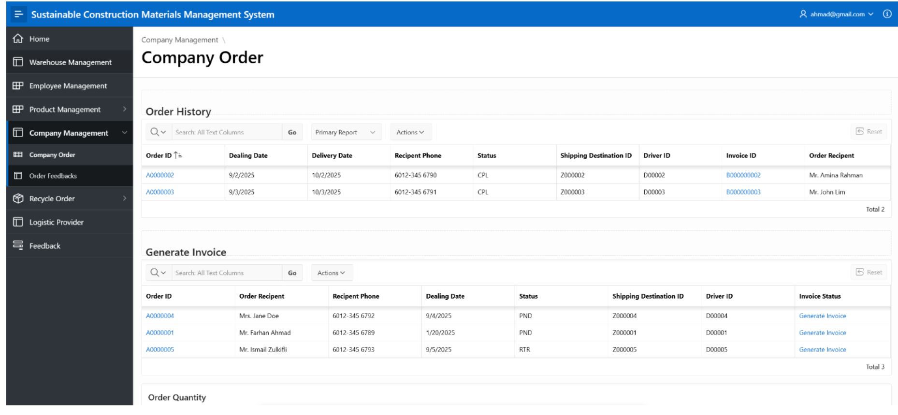
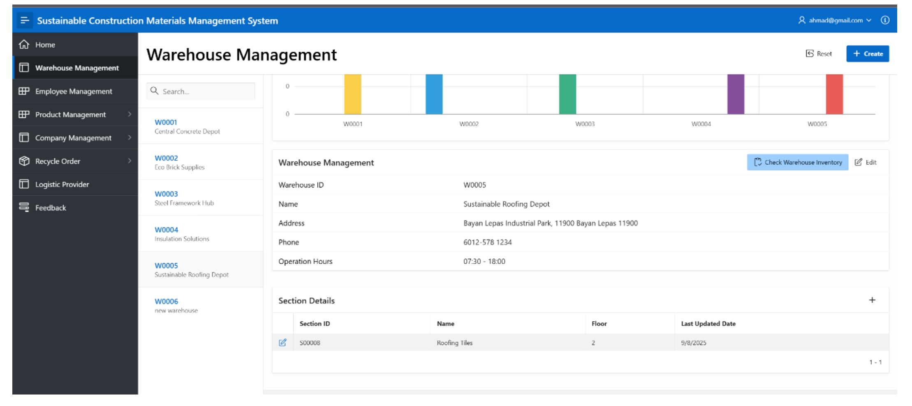
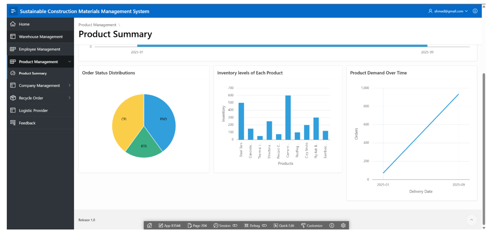
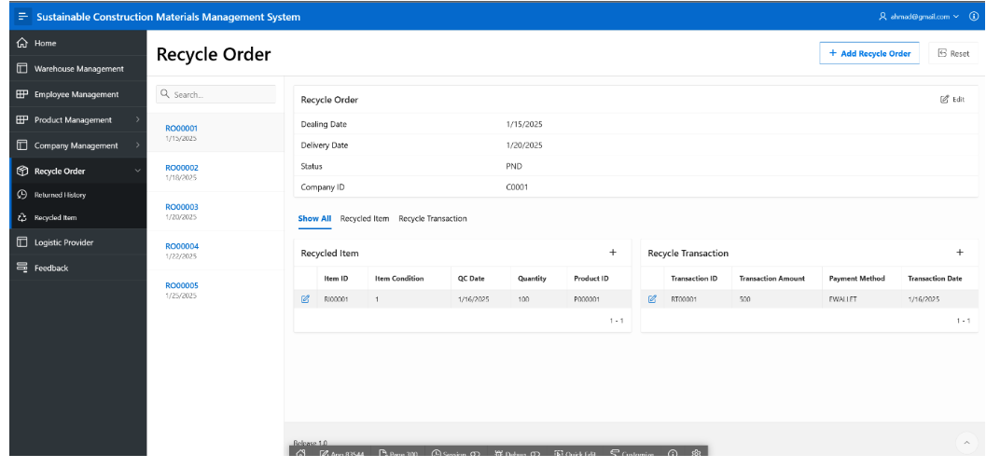
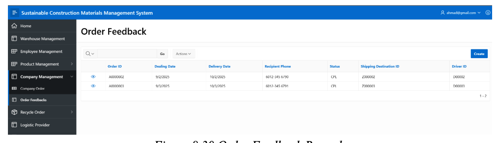

# Sustainable Construction Materials Management System (CMT221)

A web-based management system built using Oracle APEX to coordinate sustainable construction material workflows. The system enhances visibility of material usage, supports recycling initiatives, and streamlines logistics across the construction value chain.

---

## 🌱 System Objectives
- Coordinate the supply chain to support sustainable practice
- Improve inventory transparency and reduce wastage
- Enable proper handling of recyclable materials
- Enhance after-sales communication and responsibility tracking

---

## 🧩 Core Modules

| Module | Description |
|--------|-------------|
| **Supply Chain Coordination** | Manage company orders, invoices, and logistics providers across the material delivery workflow |
| **Inventory & Storage Management** | Track product details, monitor stock levels, and manage warehouse locations & sections |
| **Sustainable Material Collection** | Handle recycled material orders & promote material recovery |
| **After-Sales Support** | Collect user feedback for service improvement |

These modules work together to encourage responsible material usage and reuse.

---

## 🛠️ Technology Stack
| Layer | Technology |
|------|------------|
| Frontend | Oracle APEX |
| Backend | PL/SQL |
| Authentication | Custom PL/SQL function |
| Database | Oracle Autonomous Database (Oracle Cloud) |

---

## 🧩 Database Implementation
- **DDL Scripts**: Create all schema and relationships  
- **DML Scripts**: Insert sample data for demonstration  
- **Functions**: Login authentication and backend validation  

---

## 📸 Key System Interfaces

> Deployment expired — screenshots preserved for evaluation.

### Supply Chain Coordination

### Inventory & Storage Management

### Sustainable Material Collection

### After-Sales Support

➡️ Additional screenshots available in `/screenshots`.
